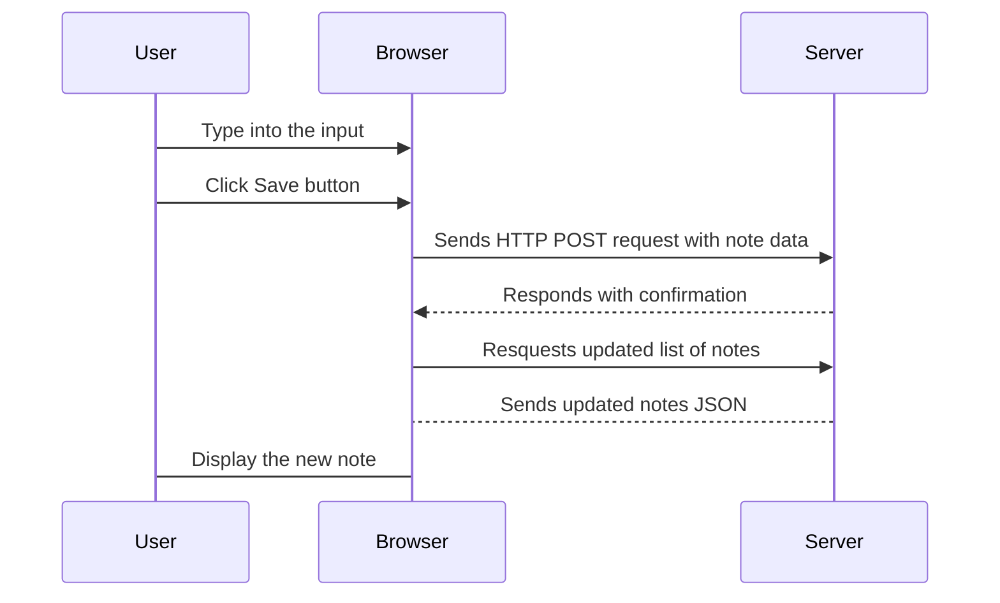

```mermaid
sequenceDiagram
     participant User
     participant Browser
     participant Server

     User->>Browser: Type into the input
     User->>Browser: Click Save button
     Browser->>Server: Sends HTTP POST request with note data
     Server-->>Browser: Responds with confirmation
     Browser->>Server: Resquests updated list of notes
     Server-->Browser: Sends updated notes JSON
     Browser->User: Display the new note
     
```